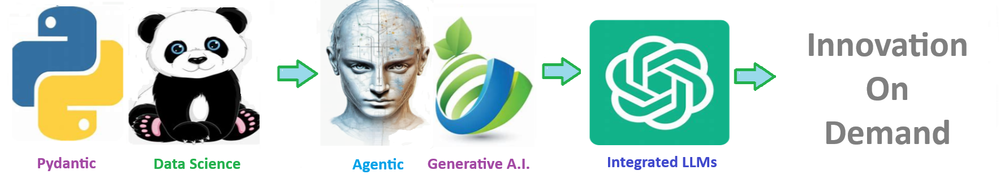

    
# Magic Classifier 

## identify if a magic command is found if chat input based upon magic keywords

    

    

Welcome to the solution **Magic Classifier** - an example for your projects

identify if a magic command is found if chat input based upon magic keywords

 
# 🧠 Magic Commands

Thrive AI supports the following intelligent functions to assist with data exploration, analytics, and service navigation:

### 🔥 `correlation heatmap`
Generate a visual heatmap showing the correlation between variables in your dataset.

### ☁️ `word cloud`
Create a word cloud from text data to highlight frequently occurring terms.

### 📊 `descriptive statistics`
Compute basic summary statistics like mean, median, standard deviation, and more.

### 📈 `epidemiology`
Run population-level analytics for disease prevalence, incidence, or risk factor profiling.

### 📉 `principal component analysis`
Perform PCA to reduce dimensionality and identify dominant patterns in your data.

### 🧹 `feature reduction`
Apply statistical techniques to remove redundant or irrelevant features.

### 🗂️ `data catalogue`
Automatically generate metadata and schema documentation for your dataset.

### 📊 `visual dashboard`
Create interactive dashboards for data visualization using tools like Plotly or Streamlit.

### 🔄 `warehouse transformation`
Execute data transformation scripts on your enterprise data warehouse.

### 👥 `employee enrichment`
Integrate internal HR or staff data for population health workforce analysis.

### 🧠 `mind map`
Generate conceptual visual maps to represent topic relationships and themes.

### 🧬 `ontology`
Link your data to a healthcare or social determinants ontology for semantic enrichment.

### 🔍 `data science`
Run data science workflows like clustering, regression, or classification on selected data.

### 🚭 `smoking cessation`
Identify populations at risk and analyze outcomes related to tobacco cessation programs.

### 🧪 `diabetes risk analysis`
Evaluate individual or population-level risk for developing diabetes based on key indicators.

### 👨‍⚕️ `Find a provider PCP`
Locate a primary care provider based on geography, specialty, and insurance.

### 🧑‍⚕️ `Find a provider Specialist`
Identify a specialist provider based on patient needs and location.

### 🏘️ `Find a social needs`
Connect users with community-based organizations addressing social needs (e.g., food, housing, transportation).

# 🧩 AI Magic Commands

#### AI magic to empower and enrich humans 

> Created by **ThriveAI  ...      Joe Eberle**  
> 🗓️ Started: April 18, 2025 
> 📫 Contact: [josepheberle@outlook.com](mailto:josepheberle@outlook.com)  
> 🔗 GitHub: [JoeEberle](https://github.com/JoeEberle/)

## Magic architecture (MVC) 

1. **Identify Magic** - Automatically identifes major steps in notebook
2. **Load Data** - 1000 rows 95% accurate or  10000 rows 98.5% accurate or load whole table (100% accurate) 
3. **Perform Magic** - process Magic to produce nlp text or .png, or plot, or dataframe, or html 
4. **Render Magic Result** - render to produce .png, or plot, or html 
5. **Magic Controller** - special commands to work with magic results 

 

    

    
## Getting Started

The goal of this solution is to **Jump Start** your development and have you up and running in 30 minutes. 

To get started with the **Magic Classifier** solution repository, follow these steps:
1. Clone the repository to your local machine.
2. Install the required dependencies listed at the top of the notebook.
3. Explore the example code provided in the repository and experiment.
4. Run the notebook and make it your own - **EASY !**
    
## Solution Features

- Easy to understand and use  
- Easily Configurable 
- Quickly start your project with pre-built templates
- Its Fast and Automated
- Saves You Time 

## ⚙️ Key Features

- ✅ **Self Documenting** Automatically identifies and annotates major steps in a notebook, making the codebase readable and well structured.
- ✅ **Self Testing** Includes built in **unit tests** for each function to validate logic and ensure code reliability.
- ✅ **Easily Configurable** Uses a simple **config.ini** file for centralized settings and easy customization through key value pairs.
- ✅ **Talking Code** explains itself through inline commentary, helping you understand both **what** it does and **why** it does it.
- ✅ **Self Logging** extends Python’s standard **logging** module for **step by step runtime insights**.
- ✅ **Self Debugging** Includes debugging hooks and detailed error tracing to simplify development and troubleshooting.
- ✅ **Low Code or  No Code** Designed to minimize complexity — most full solutions are under 50 lines of code.
- ✅ **Educational** Each template includes educational narrative and background context to support learning, teaching, and collaborative development.

    